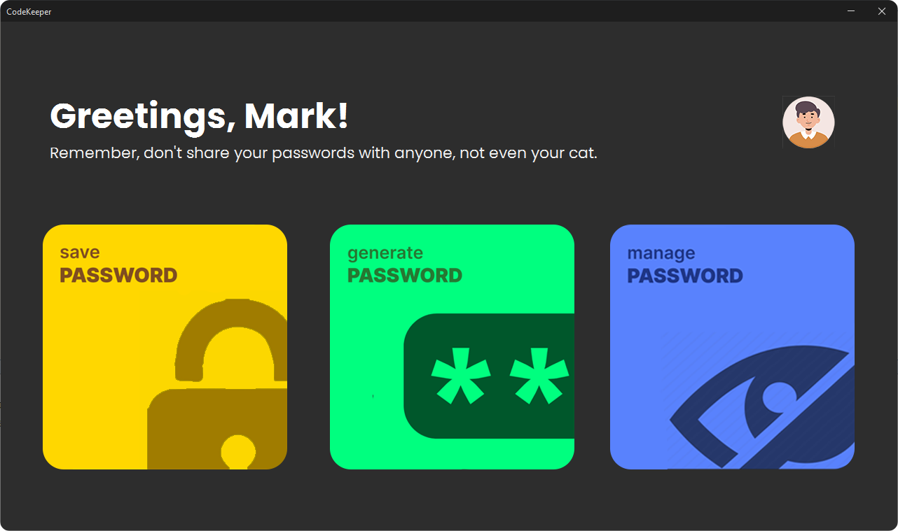
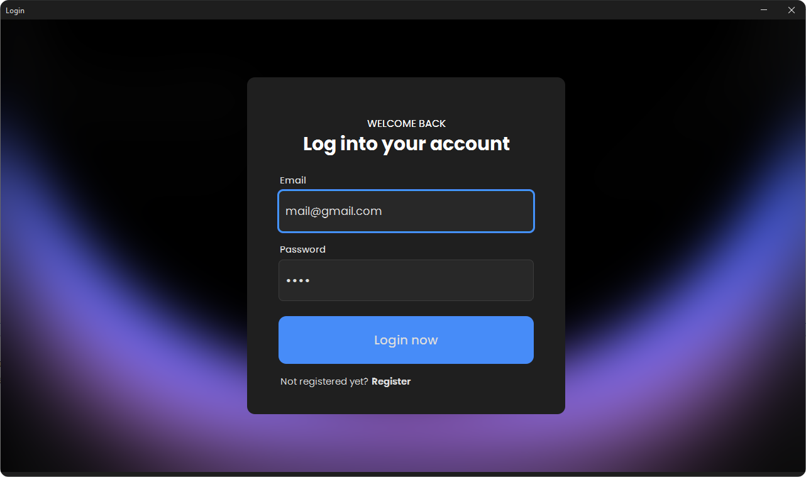
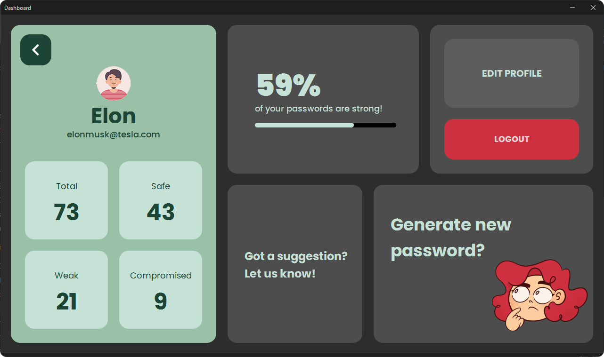
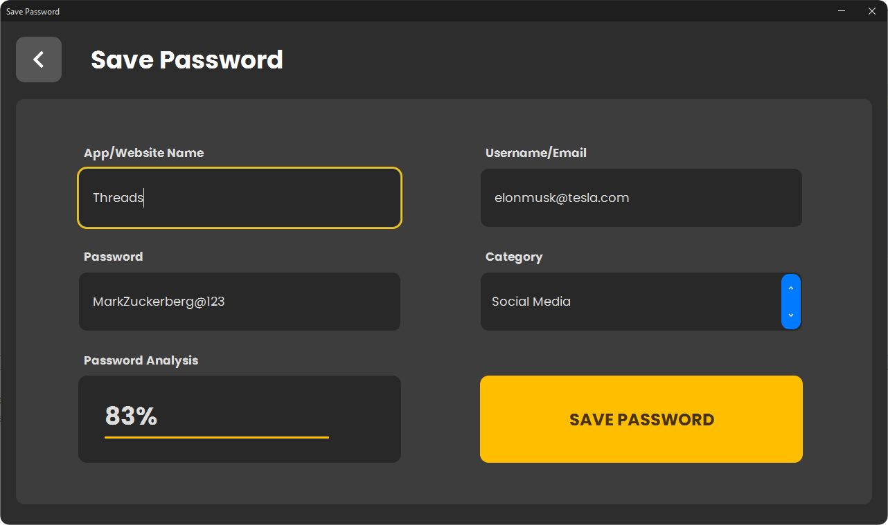
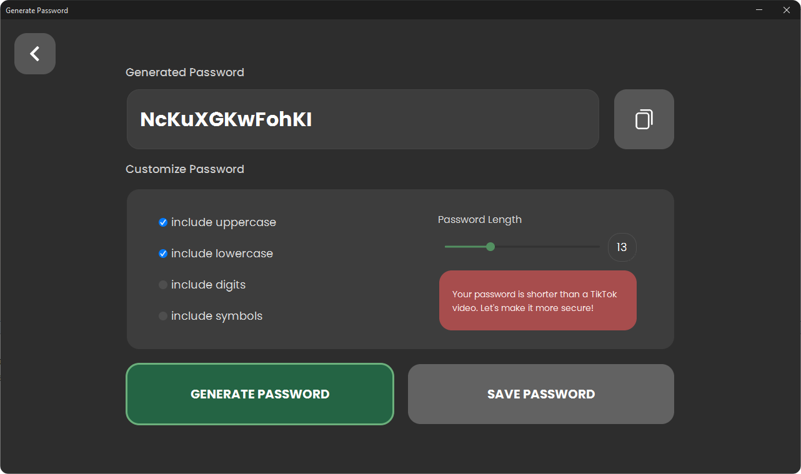

<h1 align="center"> CodeKeeper 🔐 - Your Password Manager </h1>  

  

  Your Secure Password Manager.

## Introduction 🚀

Welcome to CodeKeeper, a powerful password manager application designed to enhance security and simplify password management. CodeKeeper empowers you to generate and store strong, unique passwords, ensuring your online accounts remain secure and easily accessible.

## Technologies Used 💻

CodeKeeper utilizes various technologies to provide comprehensive password management capabilities:

- **Programming Languages and Frameworks:** Developed using Java SE (Java Standard Edition).
- **User Interface (UI) Frameworks:** Java Swing is used to create an intuitive and user-friendly interface.
- **Database Management Systems:** CodeKeeper relies on Oracle databases for secure data storage and utilizes technologies like JDBC and SQL for data management.

## Key Features 🔑

1. **Password Generation:** CodeKeeper provides a secure and user-friendly way to generate strong and unique passwords. Customize password length and character sets, including alphabets, digits, and special characters, for maximum security.

2. **User-Friendly Interface:** CodeKeeper features a clean and intuitive interface that streamlines password-related tasks, saving you time and enhancing productivity.

3. **Local Storage:** All your passwords are securely stored locally on your device. No need for an internet connection to access your passwords, ensuring convenience and reliability.

## Login Module 🔑

CodeKeeper offers a user-friendly login module, allowing users to log in or register as new users.

## Home Page 🏠

The home page provides users with a warm welcome and offers random suggestions related to passwords. Users can access their profiles and choose to save, generate, or manage passwords from here.

## Dashboard 📈

The dashboard displays user profile information, including the username, user image, email, and password statistics. Users can modify their profile, log out, or access password-related features from here.

## Save Password 📝

In the "Save Password" module, users can enter website or application details, including the name, category, username, and password. The application evaluates password strength in real-time, providing a rating out of 100%. Users can securely save the password.

## Generate Password 🔄

In the "Generate Password" module, users can create random passwords with options for uppercase characters, lowercase characters, digits, and symbols. They can customize the length and directly save the generated password.

## Manage Passwords 🗄️

The "Manage Passwords" module presents users with a list of all saved data, enabling them to modify, view, or delete information as needed.

## Security Focus 🔒

CodeKeeper prioritizes your data's security. With encryption and local storage, your sensitive information is well-protected, aligning with the importance of online privacy and data protection.

## User Experience 🌟

CodeKeeper is designed with user experience in mind. Its user-friendly interface simplifies password management, making it accessible to a wide range of users. Generate and store strong passwords with ease, reducing the risk of unauthorized access to your accounts.

## Customization 🎨

Customize generated passwords to match specific website or platform requirements, ensuring compatibility with various password policies.

## Password Encryption 🔐

In CodeKeeper, password encryption is implemented using the Base64 algorithm along with a custom algorithm for additional security. Passwords are modified before encryption to provide an extra layer of protection against potential attackers.

## Screenshots 📸

  
  
  
  
  

## Installation 🛠️

To get started with CodeKeeper, follow these simple steps:

1. **Install Java Runtime Environment (JRE):** Ensure you have Java Runtime Environment (JRE) installed on your system. You can download the latest version of JRE from the [official Oracle website](https://www.oracle.com/java/technologies/javase-jre8-downloads.html).

2. **Set Up the Database:**
   - Install an Oracle database system if you don't have one already. You can download Oracle Database Express Edition (XE) for free from the [official Oracle website](https://www.oracle.com/database/technologies/xe-downloads.html).
   - Create the necessary tables in your database.

3. **Update Connection Information in Code:**
   - Open the `DBConnection.java` file in your project.
   - Update the database connection details, including the URL, username, and password, to match your Oracle database configuration.

4. **Compile and Run CodeKeeper:**
   - Compile the CodeKeeper application using a Java IDE or the command line.
   - Run the application, and you're ready to go!

That's it! You've successfully installed and set up CodeKeeper for your password management needs.

## Usage 📖

To start using CodeKeeper, follow these steps:

1. **Launch CodeKeeper:**
   - Compile and run the CodeKeeper application.
   - On the login screen, use your credentials to log in as a user.

2. **Explore CodeKeeper:**
   - Once logged in, you'll have access to the features and modules of CodeKeeper. You can manage your passwords, generate new ones, and customize your settings.

## Contributing 🤝

We welcome contributions to improve and expand CodeKeeper. Whether you're a developer, designer, tester, or just an enthusiastic user, there are several ways you can contribute to the project:

- **Reporting Issues:** If you encounter a bug or have a suggestion for improvement, be sure to provide detailed information about the issue, including steps to reproduce it.

- **Documentation:** Help improve our documentation by fixing typos, adding missing information, or clarifying existing content. Documentation changes can also be submitted through pull requests.

- **Testing:** Test the application thoroughly and report any issues you discover. Your testing and feedback are valuable for improving the application's stability and functionality.

- **Spread the Word:** Share CodeKeeper with others who may benefit from it. The more users and contributors we have, the better the application becomes.

We encourage open and constructive collaboration to make CodeKeeper even better.

   
  <b>CodeKeeper</b> 
  Your Secure Password Manager.
    

  
---
